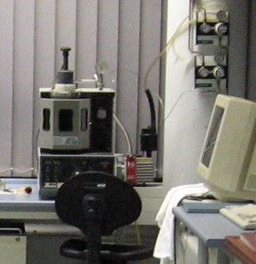

Especially at the start of my doctoral studies at the IFW in Dresden, I began my studies of **Heusler compounds** (X$_2$YZ) by growing samples using the lab's arc-melter. Advantages of this sythesis method, over single crystal growth using a mirror floating zone furnace, include fast growth and quenching can result in chemical phases not thermodynamic equilibrium. 

One must first measure the ingredients - rather a bit tougher with pure metals than oxide powders - and place in a depression in a copper "hearth". Place a titanium **getter** in another depression, away from the ingredients (lest Ti contamination is desired). The chamber is sealed and vacuum is created with a pump, and the atmosphere is flushed with Ar a few times. A plasma "arc" is created by a tungsten (W) tip making contact with a part of the copper hearth (controlled with the black rubber "video game toggle" seen above the chamber in figure below) when a voltage differential is applied. Then the Ti getter is first melted in order for any residual oxygen in the chamber to be absorbed (creating partial TiO2) thus removing from chamber atmosphere. This is done by controlling the upper W-tip and slowly (but continuously) swirling it around the outside of the Ti getter, bringing the arc slowly closer until the ingot is fully melted for a few seconds, during which time any oxygen would readily absorb onto the Ti. After this is done, the tip - careful to never let the tip actually touch the materials - is brought in the same manner around the intermetallic alloy/compound crystal ingredients...

The reason the resultant ingot is a polycrystal is due to the fast cooling, inevitable when the arc is turned off. For safely preventing overheating there is a water cooling line running through the Cu hearth (don't forget to turn on before synthesis!) and this causes the fast cooling which causes the molten ingot to **quench** or cool rapidly upon removing the plasma arc.

::: {style="float:center; margin-left:10px; width:250px;"}

:::