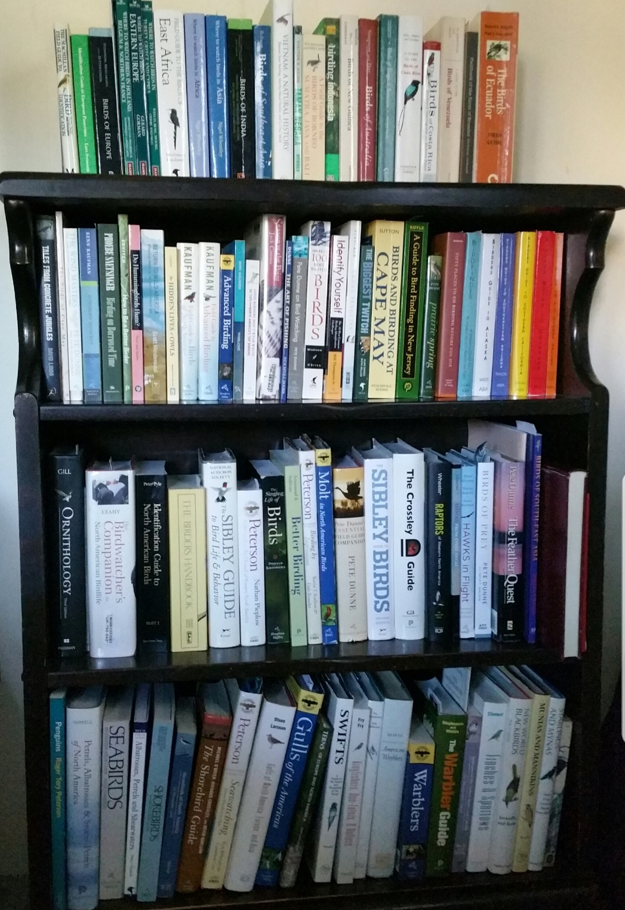
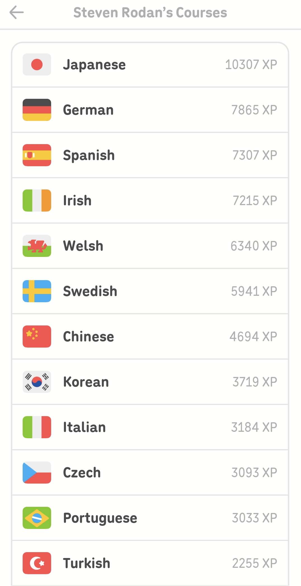

## #1 Birding

### World Listing (via eBird)
(*The following numbers were last updated on March 23, 2026*)

* ***World: 1317***
* Asia: 565
* United States: 399
* New Jersey (home state): 345
* Cape May County (hometown): 331
* Ecuador: 300
* South Korea: 259
* Photographed Species: 207

---

## #2 Language Learning

In my freetime, if I am not outdoors looking for birds, I might be taking a 30-minute break to study any of 30+ languages I've dabbled in since I fell in love with foreign cultures around the age of 11 or 12 (rather than any initial interest in the subject of linguistics). I think the catalyst that sent me on the course to become a polyglot, was my first visit to the World Showcase at EPCOT park in Walt Disney World, as two of the earliest languages I became obsessed with were German and Norwegian. So you could say, when I landed in Dresden for my doctoral work, a 14-year-old dream had come true!

To see which languages I can speak to some level of fluency or at a minimum hold basic conversation in, check out my [short CV here](cv.qmd).

::: {.columns .v-center}
::: {.column width="57%"}

:::

::: {.column width="43%"}

:::
:::

<!-- ::: {style="float:center; margin-left:20px; width:300px;"}

::: -->