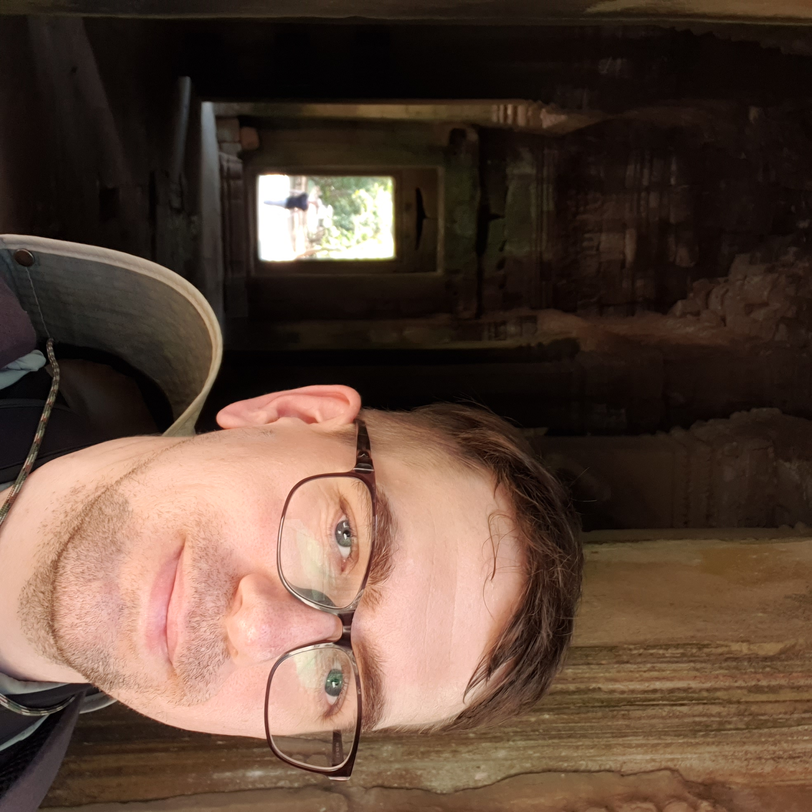

<!-- ::: {style="float:right; margin-left:20px; width:250px;"}

*Inside one of my favorite Angkorian temples (Preah Khan), Siem Reap, Cambodia — Jan 2024*
::: -->

{style="float:right; margin-left:20px; width:250px;"}

# Welcome to my personal homepage!

I am an experimental physicist trained in two complimentary fields - **particle astrophysics** and **quantum materials** - and now building an independent research program at their intersection. The idea to create this page stemmed from the desire to explain the story of my non-traditional trajectory, blog about topics - hot and/or fascinating, maybe discussing or highlighting measurement techniques, or more theoretic (equation-heavy) posts with derivations and commentary on implications for experimentalists. The other main reason is to showcase - through images and descriptions - the breadth of my background in so many experimental techniques, which has allowed me to see interdisciplinary bridges someone trained in only one field might miss.
Currently, I am part of the [IceCube Neutrino Observatory](https://icecube.wisc.edu) collaboration and the Neutron Monitoring , exploring low-energy cosmic rays and novel materials for light dark matter detection. 

* Here is my [ResearchGate profile](https://www.researchgate.net/profile/Steven-Rodan?ev=hdr_xprf).
* Here is my updated (*Jan 23, 2026*) [curriculum vitae](CV_SRodan.pdf)

# Quickly Navigate This Site

::: {.columns}

::: {.column width="40%" .card}
### Research
Explore my projects in cosmic rays and quantum magnetic materials.
[Learn more →](research.qmd)
:::

::: {.column width="40%" .card}
### Experiments
Here I review ALL synthesis and materials characterization techniques I've experience in.
[Learn more →](techniques.qmd)
:::

::: {.column width="40%" .card}
### Publications
Curated publications and preprints in IceCube and light dark matter.  
[See publications →](publications.qmd)
:::

::: {.column width="40%" .card}
### Blog
Research notes, sketches, and ideas in physics and materials science.  
[Read blog →](blog/)
:::

:::

**Contact:**  
Email: [steven.rodan84@gmail.com](mailto:steven.rodan84@gmail.com)  
GitHub: [strodan84](https://github.com/strodan84)  
ORCID: [0000-0002-9886-4178](https://orcid.org)
