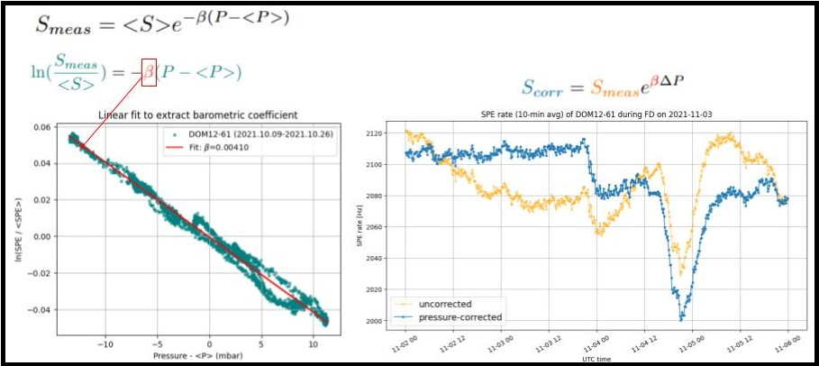
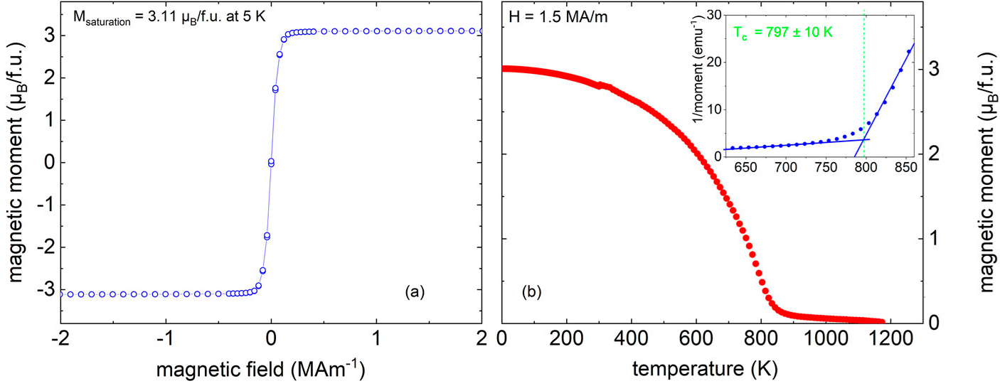
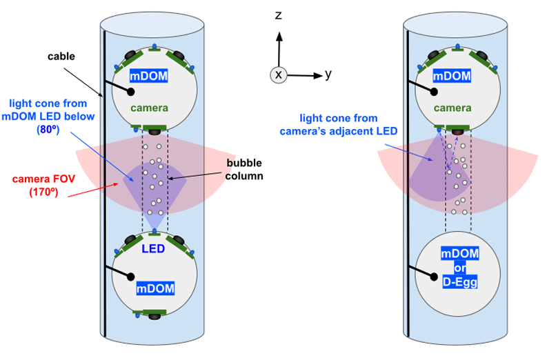
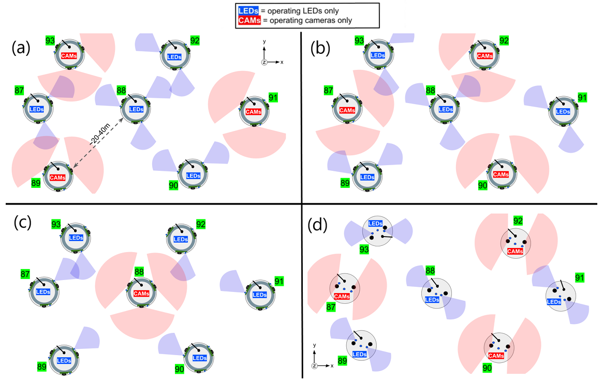
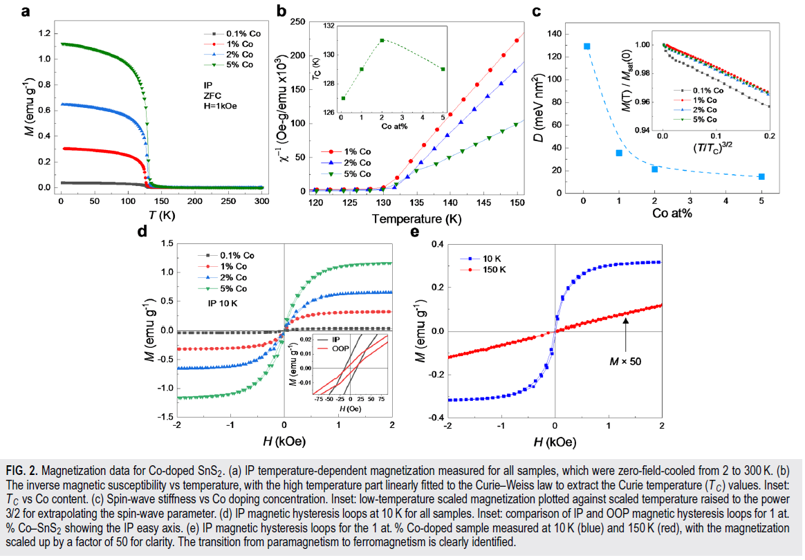
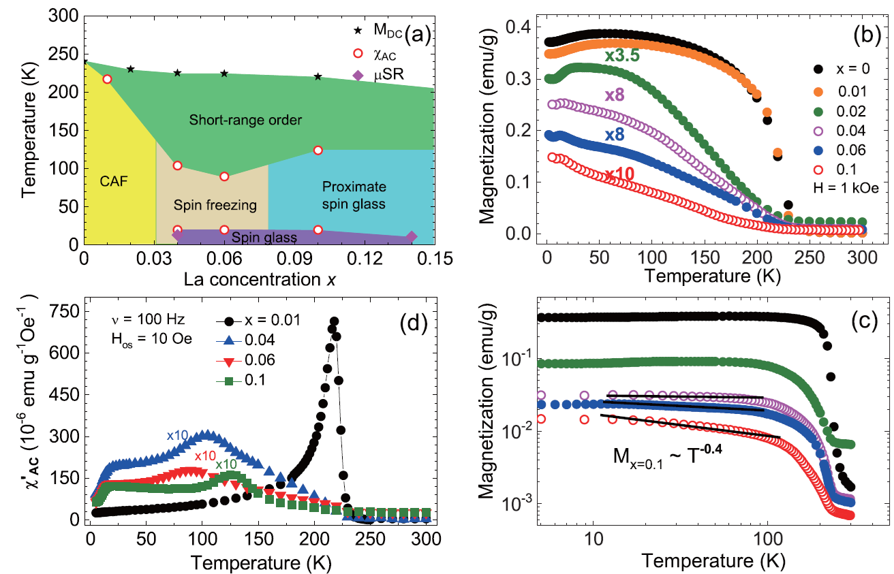
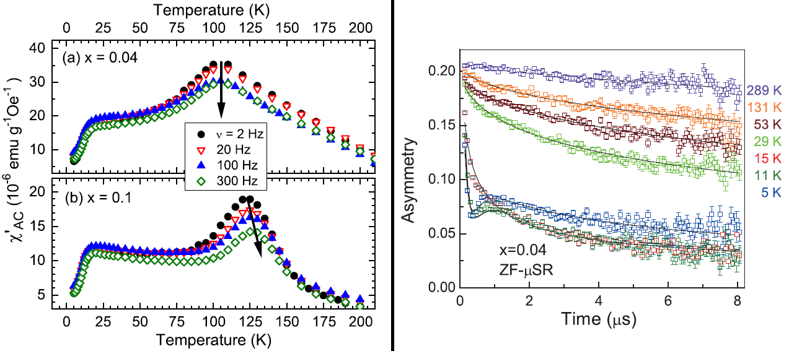

**Download my COMPLETE publications list here:**  
[Steven_Rodan_publications_20260311](fullpublications.pdf)

---

## Selected Journal Publications

- *Solar Flare Modulation of IceTop Count Rates During Forbush Events Observed by the South Pole Neutron Monitor*    
    **Steven Rodan**, [The IceCube Collaboration]      
    Draft in preparation (anticipated 2026)  

::: {style="float:center; margin-left:10px; width:700px;"}

:::

---

- *Material Design Towards a Thermodynamically Stable Co-Cr-Fe-Al Heusler-Type Phase*  
    A. Omar, F. Börrnert, M. Richter, J. Trinkauf, F. Heinsch, C.G.F. Blum, V. Romaka, **Steven Rodan**, et al.    
    [*APL Materials* **13**, 051118 (2025)](https://pubs.aip.org/aip/apm/article/13/5/051118/3346976)

::: {style="float:center; margin-left:10px; width:600px;"}

:::

---

- *Operations plans and sensitivities of the IceCube Upgrade Camera System*  
    **Steven Rodan**, Christoph Tönnis, Jiwoong Lee, Carsten Rott  
    *The 38th International Cosmic Ray Conference (ICRC2023)*, PoS at arXiv:[2308.07276](https://arxiv.org/abs/2308.07276)

::: {.columns .v-center}
::: {.column width="35%"}

:::

::: {.column width="45%"}

:::
:::

---

- *Enhanced magnetic moment with cobalt dopant in SnS$_2$ semiconductor*  
    H. Bouzid, **Steven Rodan**, K. Singh, Y. Jin, J. Jiang, D. Yoon, H.-Y. Song, Y.-H. Lee  
    [*APL Materials* **9**, 051106 (2021)](https://aip.scitation.org/doi/10.1063/5.0048885)   

::: {style="float:center; margin-left:10px; width:800px;"}

:::
    
::: {.callout-note}
**My contribution:** I had co-first-authored this paper with a then-graduate student on the characterization of a dopant-induced high Curie-temperature ferromagnetic state in non-magnetic SnS$_2$ van der Waals semiconductor.
::: 

---

- *Quantum critical nature of the short-range magnetic order in Sr$_{2 - x}$La$_x$IrO$_4$*  
    **Steven Rodan**, Sungwon Yoon, Suheon Lee, Gareoung Kim, J.-S. Rhyee, A. Koda, W.-T. Chen, Fangcheng Chou, K.-Y. Choi  
    [*Phys. Rev. B* **98**, 214412 (2018)](https://journals.aps.org/prb/abstract/10.1103/PhysRevB.98.214412)  

::: {.columns .v-center}
::: {.column width="35%"}

:::

::: {.column width="45%"}

:::
:::

::: {.callout-note}
**My contribution:** I synthesized the crystal samples, performed physical characterization measurements, and traveled to the JPARC facilities to perform muon spin rotation experiments to probe the magnetic dynamics in the quantum critical material.
::: 

- *Half-Metallic ferromagnetism with unexpected small spin splitting in the Heusler compound Co$_2$FeSi*    
    D. Bombor, C.G.F. Blum, O. Volkonskiy, **Steven Rodan**, S. Wurmehl, C. Hess, B. Büchner  
    [*Phys. Rev. Lett.* **110**, 066601 (2013)](https://journals.aps.org/prl/abstract/10.1103/PhysRevLett.110.066601)  

- *Nuclear magnetic resonance reveals structural evolution upon annealing in epitaxial Co$_2$MnSi Heusler films*  
    **Steven Rodan**, A. Alfonsov, M. Belesi, F. Ferraro, J.T. Kohlhepp, H.J.M. Swagten, B. Koopmans, Y. Sakuraba, S. Bosu, K. Takanashi, B. Büchner, S. Wurmehl  
    [*Appl. Phys. Lett.* **102**, 242404 (2013)](https://aip.scitation.org/doi/10.1063/1.4811244)  

::: {.callout-note}
**My contribution:** I performed the NMR measurements, using a setup that I helped commission, on both bulk crystals (grown by me) and thin films provided by collaborators.
::: 

