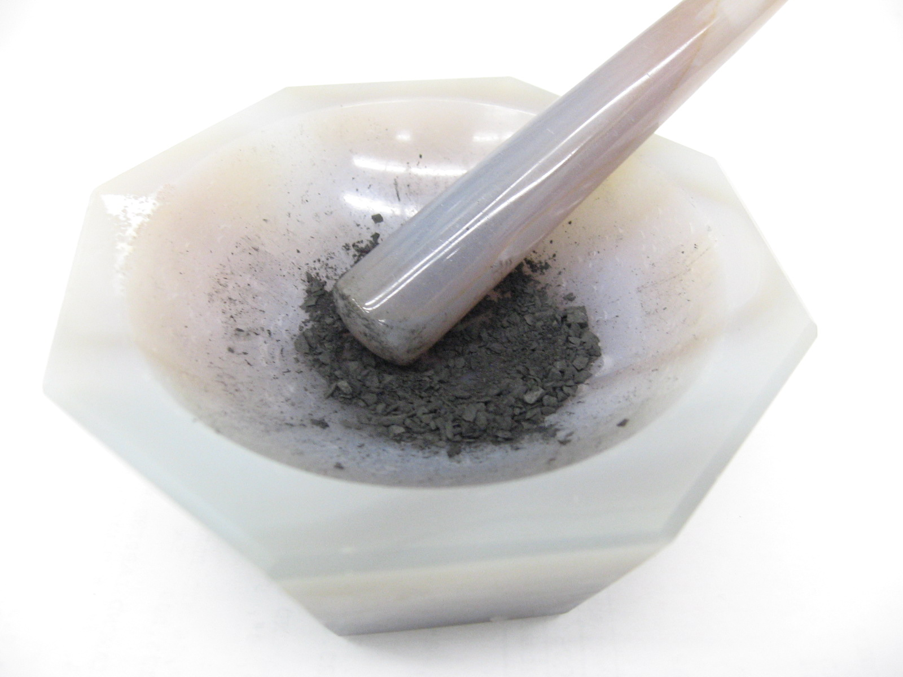
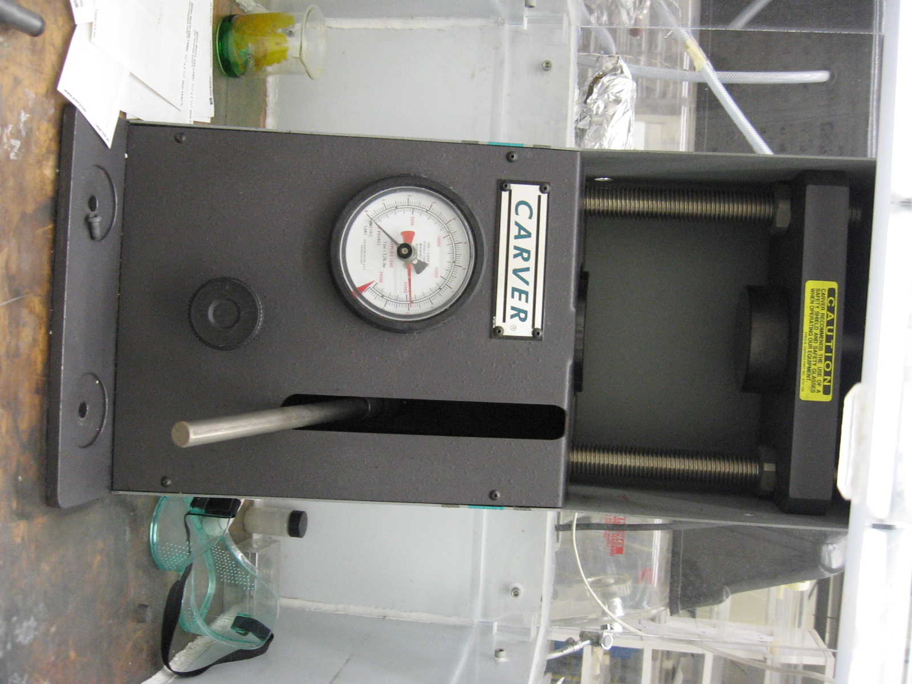
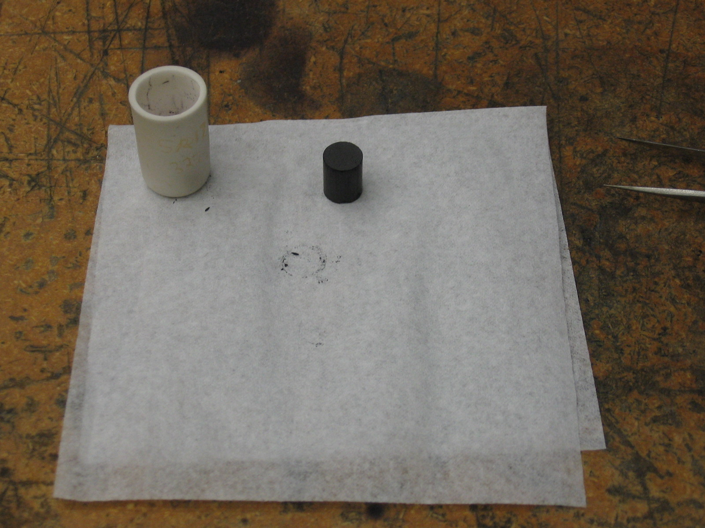
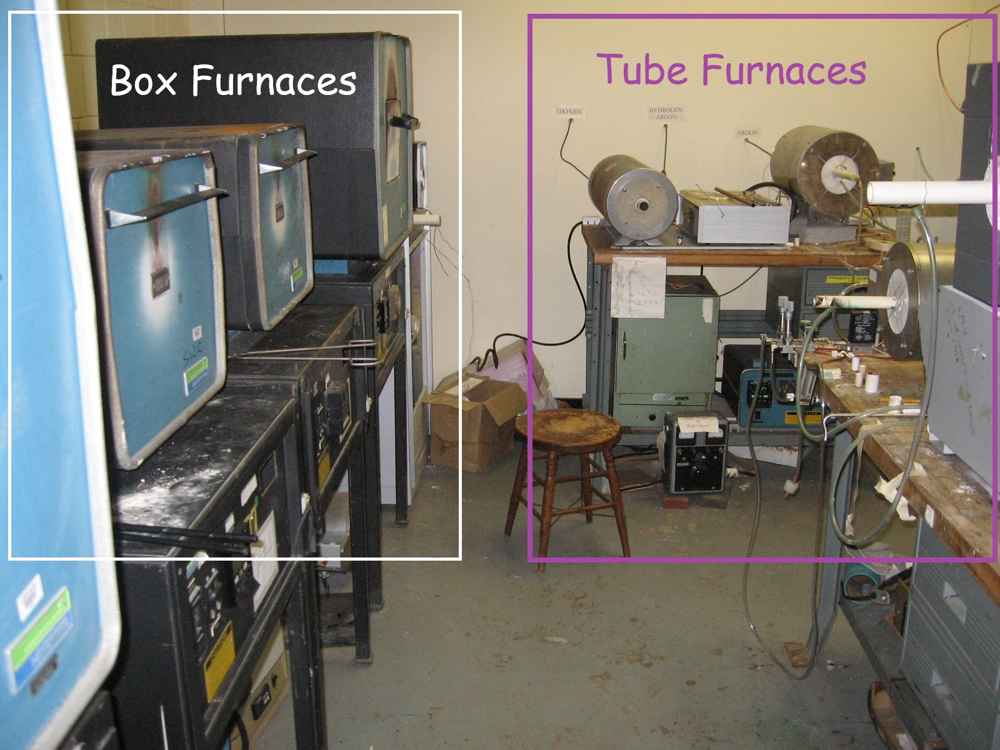

This is step one in any course on inorganic crystal growth, and was my introduction as well. The idea is to weigh oxide powders to the correct ratio - based on molar masses, chemical composition and amount of sample you want to make in total (typically 2 grams for new samples) - and then mix them very thoroughly in a clean box (with ventilation inside) using an agate mortar and pestle.

::: {.columns .v-center}
::: {.column width="45%"}

:::

::: {.column width="45%"}

:::
:::

Then one pressures the powder into a pellet, carefully place in a ceramic crucible, and bake in a box or tube furnace at not-too-high temperature to **calcinate** the sample pellet.

::: {.columns .v-center}
::: {.column width="40%"}

:::

::: {.column width="50%"}

:::
:::

::: {style="float:center; margin-left:10px; width:500px;"}

:::

After cooling sample, removing from furnace, the pellet is re-ground and pelletized again for the first true **sintering** at higher temperature to promote rearranging molecules into many, randomly oriented molecules of the correct stoichiometry and thus, after several (typically 2-3) such sinterings - always with intermediate grinding - the final sample will be a **polycrystal** whose structure is typically first checked readily with [**powder X-ray diffraction (XRD)**](powderxrd.qmd).

