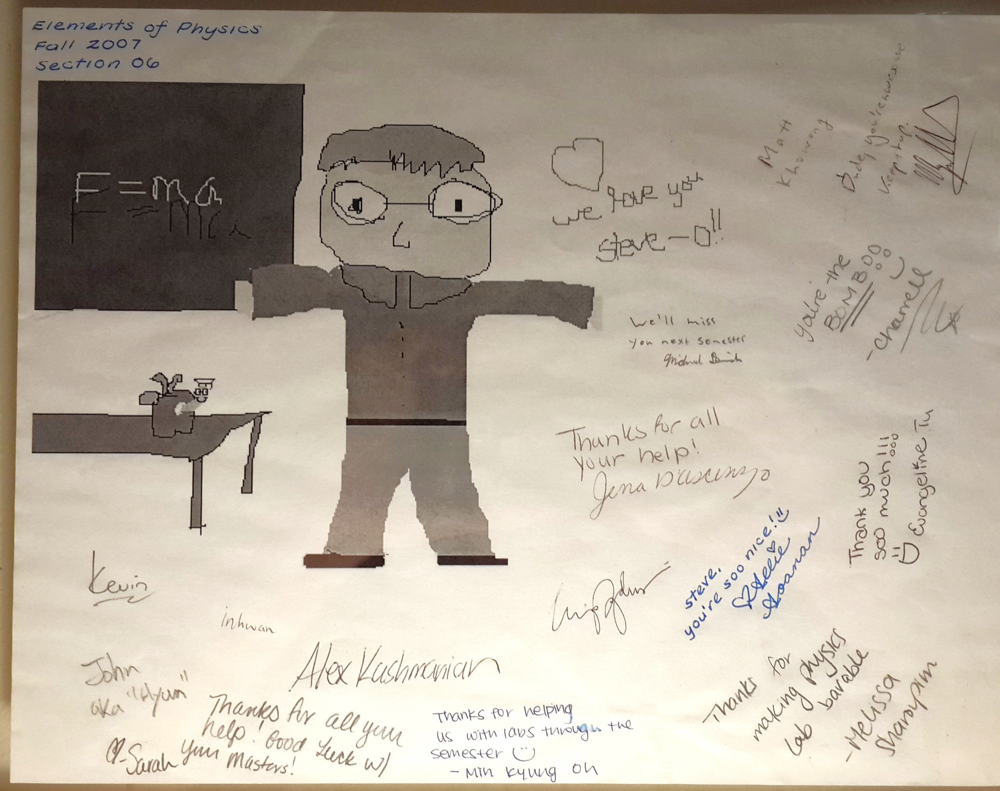

## Teaching Assistant: Introductory & Engineering Physics

- Location: Rutgers University
- Period: 2007--2008
- ***Elements of Physics***  (Fall 2007, Fall 2008)
    - Led laboratory sections for an accelerated, one-semester physics course required for pharmacy students, covering mechanics, waves, and introductory quantum concepts.
- ***Analytical Physics II Laboratory*** (Spring 2008, Spring 2009)
    - Instructed laboratory sections for the second semester of a calculus-based physics sequence for engineering students, with emphasis on electromagnetism and introductory quantum mechanics.
- Delivered weekly instruction, graded assignments and lab reports, and provided individualized academic support during office hours.
- Teaching load: 9 hours/week; 3 lab sections per semester with 20--30 students per section.

::: {style="float:center; margin-left:20px; width:600px;"}

:::

---

## Lecturer / Study Group Instructor: Particle & Astroparticle Physics

- Location: Sungkyunkwan University (SKKU)
- Period: 2022--2024
- Organized and led biweekly instructional study groups for graduate students and advanced undergraduates in astroparticle physics.
- Taught advanced topics including quantum field theory, neutrino physics, and dark matter phenomenology.
- Mentored students through problem-solving sessions and guided discussions of current research literature.
- Class size: 8--10 students.

---

## English as a Second Language (ESL) Teacher: Curriculum Design & Instruction

- Location: EBY Talking Club, Uijeongbu, South Korea
- Period: 2016 (May - Dec)
- Designed and implemented a year-long ESL curriculum for elementary and middle school students at a private language academy.
- Emphasized clear communication, student engagement, and differentiated instruction for learners with diverse language backgrounds.
- Class size: 15--20 students.

::: {.callout-note}
*Reason for taking this position was the combination of strong personal desire to live in South Korea when there were no readily available postdocs I could apply for, and simultaneously needed an income; I figured I could find a research position from one of the universities "on the ground", and I did within seven months!*
::: 

